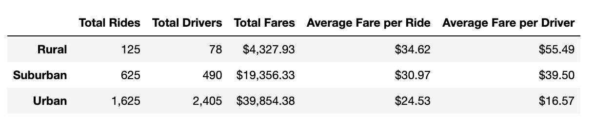
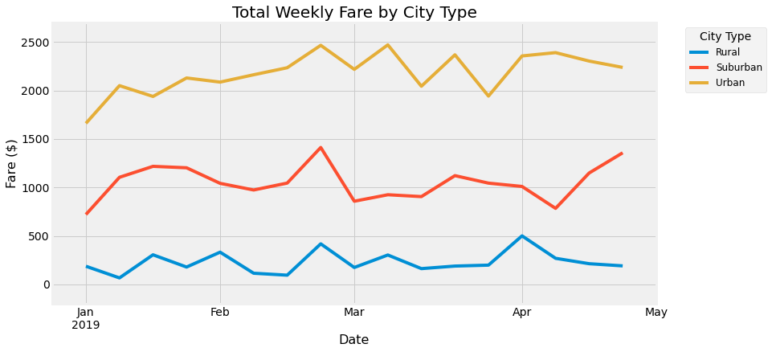

# PyBer_analysis


## 1. Project Overview

Here, I used Pandas and Matplotlib in Jupyter Notebooks to analyze ride-sharing data from multiple cities. 
I summarized and compared the numbers of rides, drivers, and fares between cities classified as either urban, suburban, or rural.
I also calculated weekly total fares in each city type and visualized their comparison across four months in 2019. 


## 2. Results

Raw analyses and results are available in the notebook ```PyBer_Challenge.ipynb```

### Data Summary

The dataset comprises ride-share data from 1 Jan - 8 May 2019. Across this timeframe, urban cities had the highest number of rides, drivers, and total fares,
followed by suburban and then rural cities. Fares per ride and per driver, however, were highest in rural cities and lowest in urban cities:



### Weekly Fares by City Type

From 1 Jan to 28 Apr 2019, urban cities had the highest total fares per week in all weeks. Rural cities had the lowest total fares in call cases.
Weekly fares increased gradually in urban cities from January to March, but otherwise fares remained generally consistent across dates for all city types,
with some minor variation between weeks. Qualitatively, relative fares remained consistent between city types across the duration of this data set. 




## 3. Summary

Overall, the number of drivers and rides appears to increase with increasing urban density, and per-ride fares decrease with increasing density.
If a goal is to decrease per-ride costs for consumers, then recruiting more drivers to offer more rides will likely help. 
However, this may be difficult in rural cities with a limited pool of potential drivers. 
If increasing total incoming fares is a goal, then increasing the number of drivers and rides will likely help in any city type.